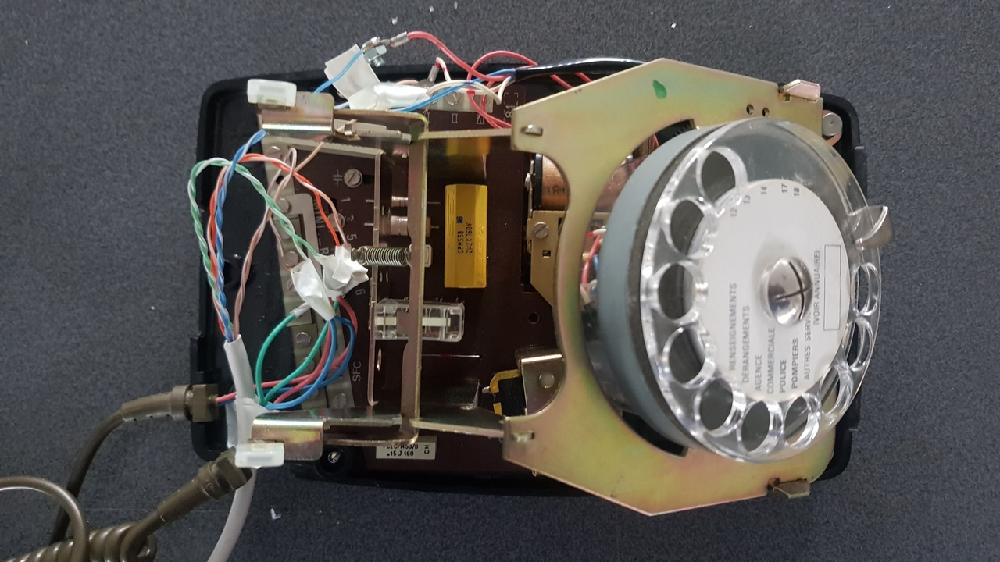

# rpi-messagerie-cadran
Projet d'une messagerie téléphonique sur un téléphone à cadran avec une Raspberry Pi

# Hardware
- une RPI 1 modèle B
- une carte son externe usb
- deux prises jack
- un téléphone à cadran socotel
- un microphone electret
- un vieu cable ethernet

Le téléphone à cadran est aucunement endomagé. Il peut être entièrement remonté à l'origine quand le projet est demantelé.

Connection des fils:
- dénudez les fils du cable ethernet sur 1cm des deux côtés
- pour les connections sur la carte, enroulez le fil dénudé autour de la vis de la carte et resserez la vis.
- pour les connections sur les fils du téléphone, utilisez des vis M3 longueur 5mm et des écrous. Serrez en sandwich le fil dénudé et le connecteur du téléphone.

Le microphone original est retiré. Il est remplacé par un petit microphone electret que l'on connecte au fils verts du combiné.

|RPI|Téléphone|
|:-:|:-|
|jack sortie masse|fil bleu combiné|
|jack sortie L+R|fil rouge combiné|
|jack entrée masse|fil vert 1 combiné|
|jack entrée L+R|fil vert 2 combiné|
|RPI GND| fil rouge/blanci du cadran + connecteur 'I' sur carte téléphone|
|RPI 23| connecteur symbole 'R' sur le carte|
|RPI 24| fil rouge du cadran |
|RPI 26| fil bleu/blanc du cadran|

# Software

Le programme est en python pour la gestion des GPIO. Pour l'enregsitrement et la lecture du son des appel aux outils `aplay` et `arecord` sont effecutés car cela est plus éfficace que les librairy python de gestion du son. L'outil `sox` est utilisé pour amplifier les sons enregistrés.

# Lancement au démarage
Sur une distribution raspbian, vous pouvez utiliser l'utilitaire `crontab` avec la ligne `@reboot` pour lancer le script au démarage.
Si vous utiliser une version avec bureau mais que vous ne connectez pas d'écran bien penser à mettre `hdmi_force_hotplug=1` dans `/boot/config.txt` afin que le session utilisateur se lance quand même.
